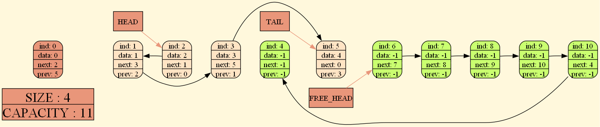

<h1>List with Graphic dump by Ruzal</h1>
<p>To work with List you need to install RuzalLib</p>
<p>Example of work:</p>

```c++
#include "List.h"
#include "GraphVizDump.h"
int main()
{
    List a;
    ListCtor(&a, 4, "Grapg_log.gv");
    ListInsertEnd(&a, 1);
    ListInsertBefore(&a, 2, 1);
    ListInsertEnd(&a, 3);
    ListInsertEnd(&a, 4);
    PrintList(&a);
    return 0;
}
```
<p>You will receive a GraphViz format file</p>
<p>To get the image you should compile him:</p>

```
dot -Tpng name.gv -o name.jpg
```

Example of dump:

